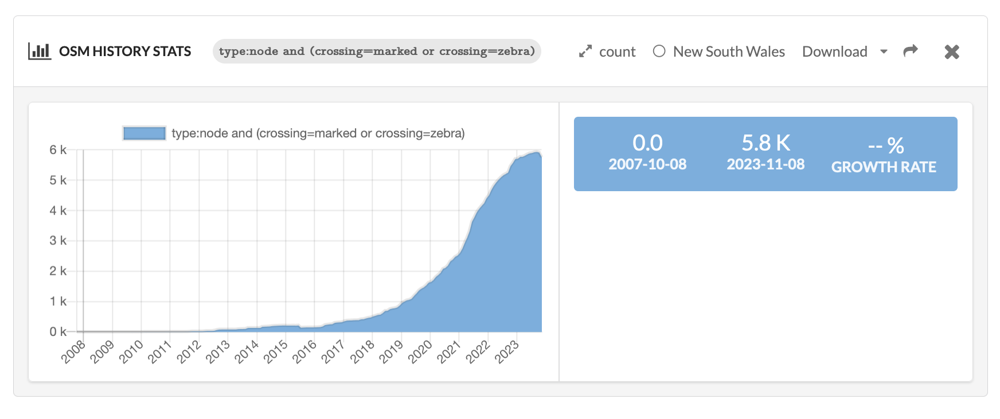

WIP

# Overpass turbo query for roads <=30kmh or living street

https://overpass-turbo.eu/s/1E2G

```
[out:json][timeout:25];
(
  way["maxspeed"="10"]["highway"]({{bbox}});
  way["maxspeed"="20"]["highway"]({{bbox}});
  way["maxspeed"="30"]["highway"]({{bbox}});
  way["highway"="living_street"][!"maxspeed"]({{bbox}});
);

out geom;
```

# Zebra crossings

## In NSW

- Work in progress: Counting how many, and by council

```

[out:json][timeout:25];
(
  rel(2316593);map_to_area
  ->.suburb;

  
  nwr["crossing"="marked"](area.suburb);
nwr["crossing"="zebra"](area.suburb);
  
);
out body;
>;
out meta qt;
```

https://overpass-turbo.eu/?Q=%5Bout%3Ajson%5D%5Btimeout%3A25%5D%3B%0A%28%0A++way%5B%22maxspeed%22%3D%2210%22%5D%5B%22highway%22%5D%28%7B%7Bbbox%7D%7D%29%3B%0A++way%5B%22maxspeed%22%3D%2220%22%5D%5B%22highway%22%5D%28%7B%7Bbbox%7D%7D%29%3B%0A++way%5B%22maxspeed%22%3D%2230%22%5D%5B%22highway%22%5D%28%7B%7Bbbox%7D%7D%29%3B%0A++way%5B%22highway%22%3D%22living_street%22%5D%5B%21%22maxspeed%22%5D%28%7B%7Bbbox%7D%7D%29%3B%0A%29%3B%0A%0Aout+geom%3B&C=-33.907038%3B151.218224%3B12&R=


## In viewport (faster)
https://overpass-turbo.eu/s/1E2E


```

[out:json][timeout:25];

nwr["crossing"="marked"]({{bbox}});
nwr["crossing"="zebra"]({{bbox}});

out geom;
```


# History


# How how number of <= 30kmh (or shared street) changed over time

- Notes:
  - OSM started in 2007 and coverage increased in years afterwards
  - Accuracy or coverage at a point in time could be estimated by graph of % of roads with a `maxspeed` as a ratio of all roads
- Todo: filter out ways that aren't roads (eg some railways)

```
type:way and (maxspeed=5 or maxspeed=10 or maxspeed=20 or maxspeed=30 or (highway=living_street and maxspeed!=*))
```

https://dashboard.ohsome.org/#backend=ohsomeApi&groupBy=none&time=2007-10-08T00%3A00%3A00Z%2F2023-11-11T22%3A00%3A00Z%2FP1Y&filter=type%3Away+and+%28maxspeed%3D5+or+maxspeed%3D10+or+maxspeed%3D20+or+maxspeed%3D30+or+%28highway%3Dliving_street+and+maxspeed%21%3D*%29%29&measure=length&adminids=-2316593


# Zebra crossings



- Caveats as above (on OSM history)

```
type:node and (crossing=marked or crossing=zebra)
```

https://dashboard.ohsome.org/#backend=ohsomeApi&groupBy=none&time=2007-10-08T00%3A00%3A00Z%2F2023-11-11T22%3A00%3A00Z%2FP1M&filter=type%3Anode+and+%28crossing%3Dmarked+or+crossing%3Dzebra%29&measure=count&adminids=-2316593

