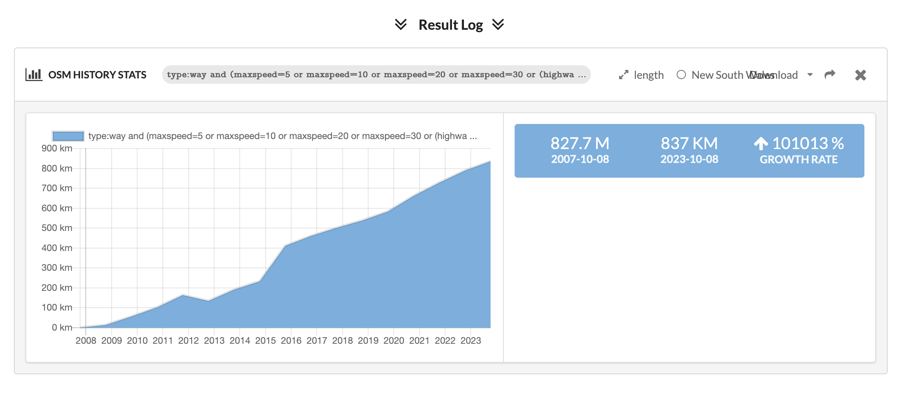

WIP

# Overpass turbo query for roads <=30kmh or living street

https://overpass-turbo.eu/s/1E2G

```
[out:json][timeout:25];
(
  way["maxspeed"="10"]["highway"]({{bbox}});
  way["maxspeed"="20"]["highway"]({{bbox}});
  way["maxspeed"="30"]["highway"]({{bbox}});
  way["highway"="living_street"][!"maxspeed"]({{bbox}});
);

out geom;
```

# Zebra crossings

https://overpass-turbo.eu/s/1E2E


```

[out:json][timeout:25];

nwr["crossing"="marked"]({{bbox}});
nwr["crossing"="zebra"]({{bbox}});

out geom;
```

# History

# How how number of <= 30kmh (or shared street) changed over time

- Todo: filter out ways that aren't roads (eg some railways)

```
type:way and (maxspeed=5 or maxspeed=10 or maxspeed=20 or maxspeed=30 or (highway=living_street and maxspeed!=*))
```

https://dashboard.ohsome.org/#backend=ohsomeApi&groupBy=none&time=2007-10-08T00%3A00%3A00Z%2F2023-11-11T22%3A00%3A00Z%2FP1Y&filter=type%3Away+and+%28maxspeed%3D5+or+maxspeed%3D10+or+maxspeed%3D20+or+maxspeed%3D30+or+%28highway%3Dliving_street+and+maxspeed%21%3D*%29%29&measure=length&adminids=-2316593

